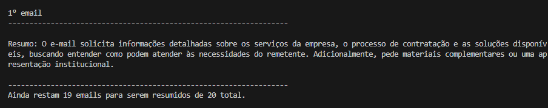

# Resumidor de Emails com Gemini AI 🤖📧

Este projeto utiliza a Inteligência Artificial do Google (Gemini) para processar uma lista de corpos de e-mail e gerar resumos curtos, diretos e eficientes. Ideal para quem recebe muitos e-mails e precisa de uma triagem rápida!

Projeto desenvolvido como parte dos meus estudos de Python em conjunto com os cursos da **Alura**.

## 📸 Print do projeto



## ✨ Funcionalidades

- **Resumo Inteligente**: Utiliza o modelo `gemini-2.5-flash` para resumos precisos.
- **Processamento sob demanda**: O sistema percorre os e-mails um a um, permitindo que você decida quando ver o próximo.
- **Configuração Simples**: Uso de variáveis de ambiente para proteção de chaves de API.

## 🚀 Como Executar

### 1. Pré-requisitos
Certifique-se de ter o Python instalado (recomenda-se versão 3.10 ou superior).

### 2. Instalação de Dependências
Abra o terminal na pasta do projeto e execute:
```bash
py -m pip install -r requirements.txt
```

### 3. Configuração da API Key
Você precisará de uma chave de API do Google Gemini. Obtenha a sua em: [Google AI Studio](https://aistudio.google.com/).

Execute o script de setup para criar o seu arquivo de configuração:
```bash
py setup_env.py
```
Depois, abra o arquivo `.env` gerado e insira sua chave:
```env
GEMINI_KAY=SUA_CHAVE_AQUI
```

### 4. Executando o Script
Para iniciar a sumarização dos e-mails, rode:
```bash
py main.py
```

## 📂 Estrutura do Projeto

- `main.py`: Ponto de entrada do aplicativo.
- `Gemini.py`: Classe responsável pela comunicação com a API do Google.
- `Inteirar_sobre_o_array.py`: Classe auxiliar para percorrer a lista de e-mails de forma eficiente.
- `setup_env.py`: Script utilitário para configurar o ambiente.

---
Desenvolvido com Python.
